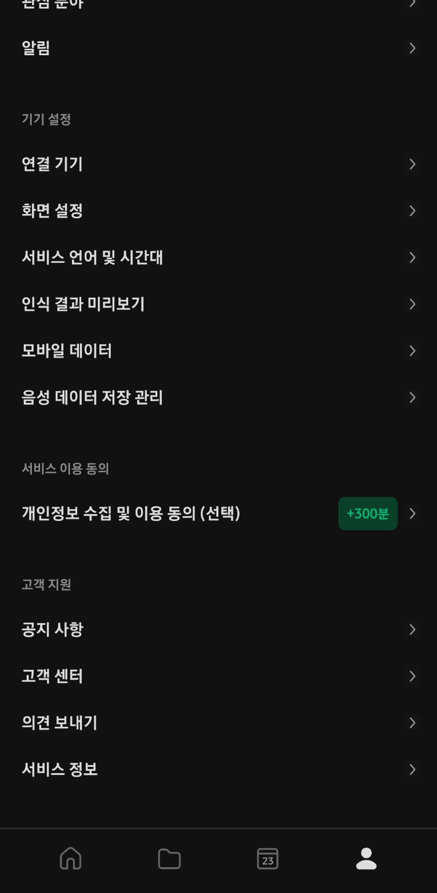
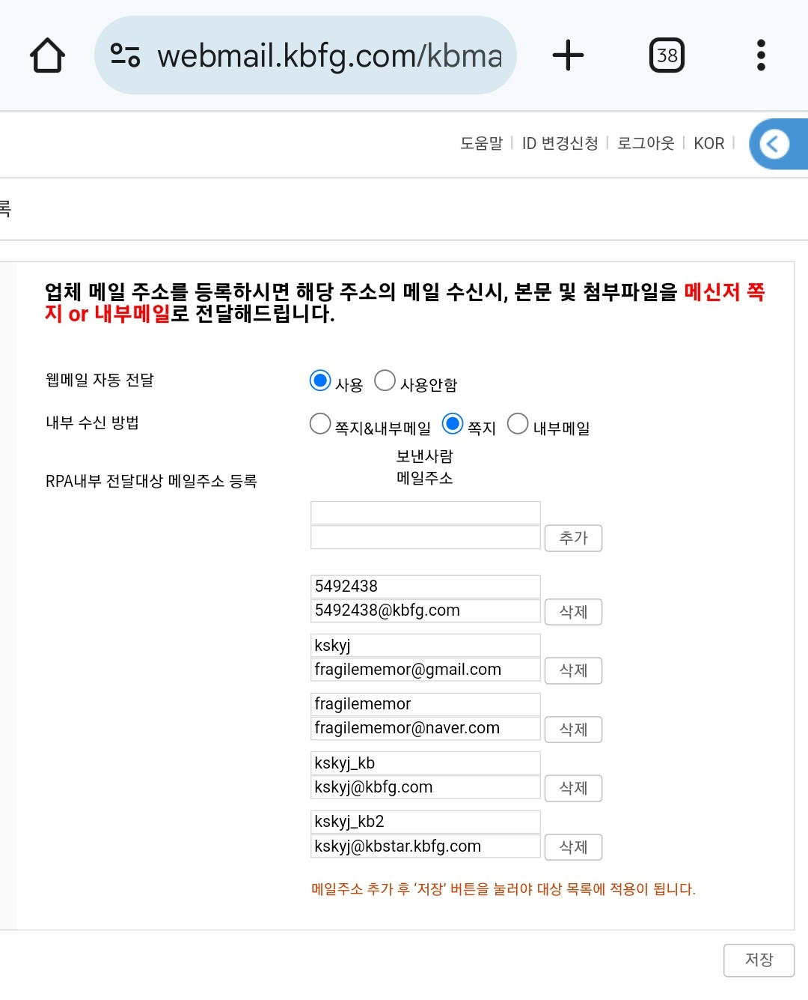
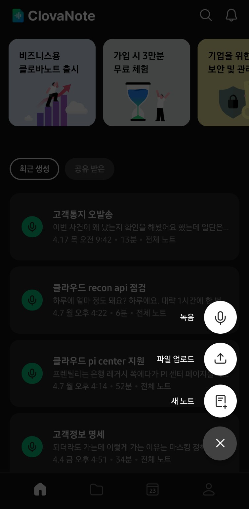
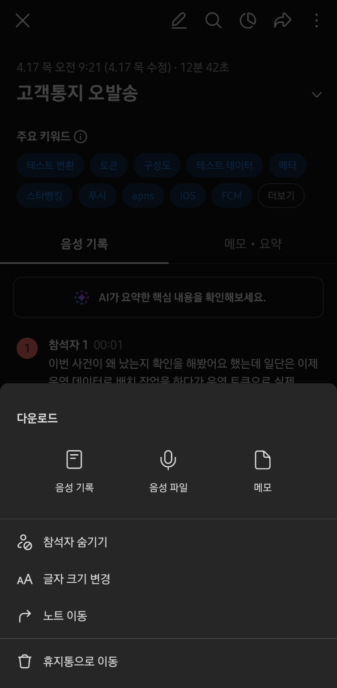
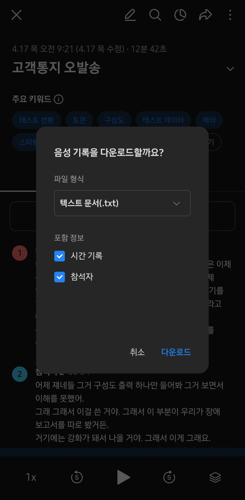
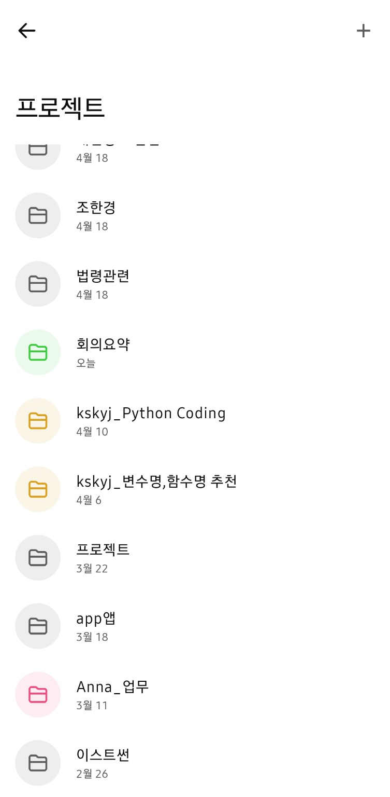
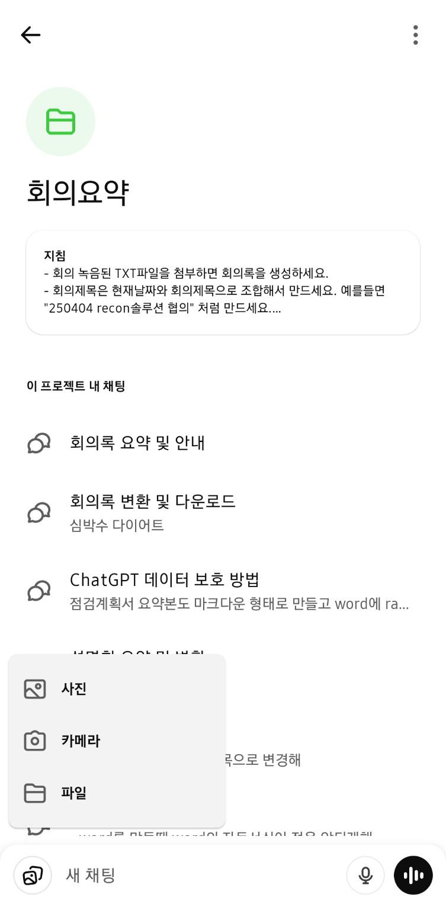
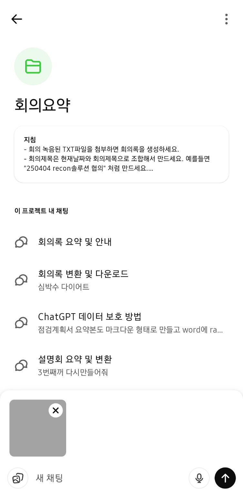
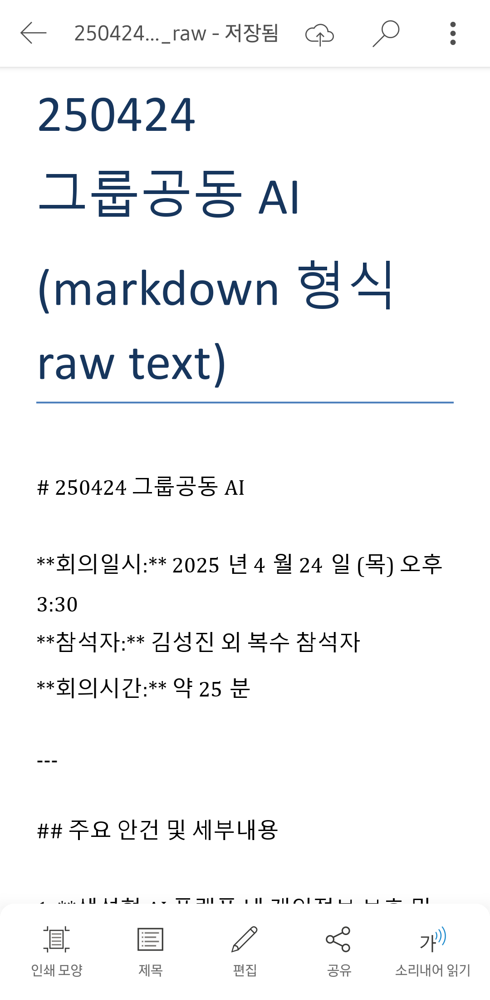

# AI기반 회의록 생성 가이드

이 가이드는 회의 녹음을 클로바노트를 통해 텍스트로 변환하고, ChatGPT를 이용해 요약하여 워드 문서로 저장한 뒤, 내부 시스템으로 자동 반입되도록 설정하는 전체 과정을 안내합니다.

> 모든 작업은 **모바일 기준**이며, 별도의 컴퓨터 없이 진행할 수 있습니다.
---

## 0. 사전 필수 설정 (개인정보 비활성화 + 내부메일 자동 반입 설정)

### 0.1 클로바노트 개인정보 수집 동의 비활성화  
- 설정 > `개인정보 수집 및 이용 동의(선택)` 항목을 비활성화

  

### 0.2 회사 웹메일 내부 반입(자동이 RPA) 사전 설정 필요
- **환경설정 > RPA내부 전달대상 메일주소 등록** 메뉴로 이동  
- 발신 이메일 주소를 등록해야 첨부파일이 자동 반입됩니다.

  

---

## 1. 회의 녹음 및 텍스트 저장 (ClovaNote)

### 1.1 클로바노트 실행 후 회의 녹음 또는 파일 업로드  
하단의 `+` 버튼 → **녹음 시작** 또는 **파일 업로드** 선택  
- **실시간 회의**는 `녹음`으로  
- **기존 음성파일**은 `업로드`로 처리

### 1.3 텍스트 내보내기
- 노트 완료 후 우측 상단 메뉴에서 `.txt` 형식으로 내보내기를 선택하세요.

  

---

## 2. ChatGPT 자동 요약

### 2.1 프로젝트 목록에서 '회의요약' 선택
- ChatGPT Plus의 프로젝트 기능을 이용해 미리 지침이 작성된 '회의요약' 프로젝트로 이동합니다.

### 2.2 txt 업로드
- 아래처럼 **프롬프트 입력 없이 `.txt` 업로드만** 하면 요약 및 Word 변환이 진행됩니다.

---

## 3. Word 파일 다운로드 및 이메일 전송

### 3.1 Word 파일 확인
- 다운로드된 파일을 열고 확인합니다.
- Confluence 에 Markdown 으로 Import 하기 위해서는, 아래와 같이 Markdown Raw Text 형태(#, * 등 이 있어야함)여야 합니다. Markdown Raw Text 형태가 아니라면, ChatGPT에게 **Markdown 형식으로 raw text 형태로 word파일 만들어줘** 라고 요청하고, 다시 다운로드 하세요.

- 별도 Word 파일로 관리하고 싶은데, Markdown형태로 Word파일이 만들어 진경우 **raw text 형태 말고, word파일 만들어줘** 라고 요청하고, 다시 다운로드 하세요.

### 3.1 이메일 전송
- ChatGPT가 제공한 `.docx` 파일을 다운로드한 후, **RPA 등록한 메일로 회사 메일 주소에 word파일을 첨부하고 전송**
- **Word** 파일과 같은 문서 파일만 RPA로 자동으로 반입됩니다.
- **발신자:** RPA에 등록한 메일 (예: `fragilememor@naver.com`)
- **수신자:** 본인 회사 메일 (예: `kskyj@kbfg.com`)

### 3.2 내부 반입 파일 열기
- 웹메일 RPA가 정상적으로 설정된 경우 쪽지로 수신한 Word 파일을 로드합니다.
---

## 4. 내부망 Confluence 에 게시(선택사항)

### 4.1 Confluence 에 등록
- Word 내용이 Markdown Raw Text 형태로 저장되어 있어야 합니다.
- Confluence 에서 **게시할 페이지로 이동** 후에 가운데 상단 **만들기 옆 ... 버튼** 을 선택하고, **Import 회의록**을 선택하고 만들기를 선택 합니다.
- 페이지 제목을 작성하고, **markup으로 변경하고 추가하세요 내용을 삭제**하고, **Ctrl + Shift + d** 를 선택하여 **문법 삽입** 에 Word 내용을 복사하면 완료 입니다. 
