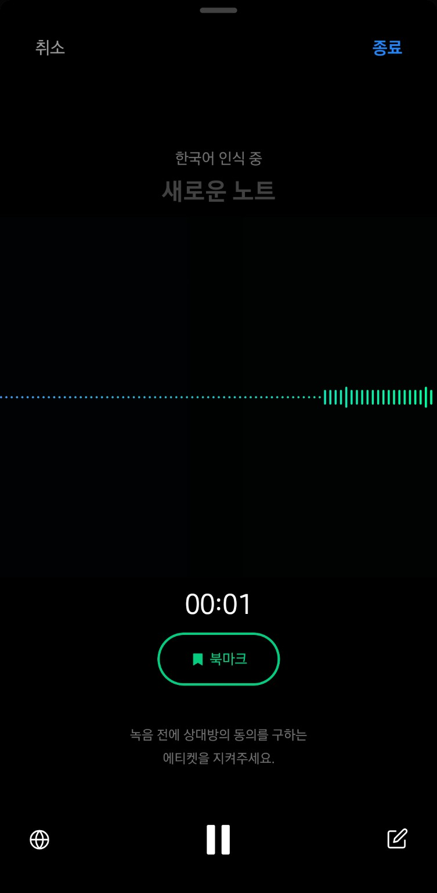
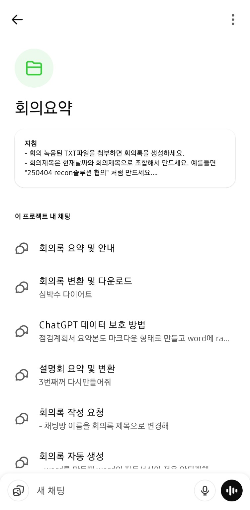

# AI기반 회의록 생성 가이드

## 0. 사전 필수 설정 (개인정보 비활성화 + 내부메일 자동 반입 설정)

### 0.1 클로바노트 개인정보 수집 동의 비활성화  
- 설정 > `개인정보 수집 및 이용 동의(선택)` 항목을 비활성화

  

### 0.2 회사 웹메일 내부 반입(RPA 설정) 반드시 사전 설정 필요
- **환경설정 > RPA내부 전달대상 메일주소 등록** 메뉴로 이동  
- ChatGPT 발신 이메일 주소를 등록해야 첨부파일이 자동 반입됩니다.

  

> 수신자는 항상 본인 회사 이메일 주소 (예: `kskyj@kbfg.com`)로 설정해야 합니다.

---

## 1. 회의 녹음 및 텍스트 저장 (ClovaNote)

### 1.1 네이버 클로바노트 실행 후 업로드 또는 녹음

### 1.2 녹음 중 화면

### 1.3 텍스트 내보내기
  

---

## 2. ChatGPT 자동 요약

### 2.1 프로젝트 목록에서 '회의요약' 선택

### 2.2 프로젝트 내부 지침 확인 및 txt 업로드

---

## 3. Word 파일 저장 및 이메일 전송

- ChatGPT가 제공한 `.docx` 파일을 저장한 후, **회사 메일 주소로 전송**
- 수신자: 본인 회사 메일 (예: `kskyj@kbfg.com`)